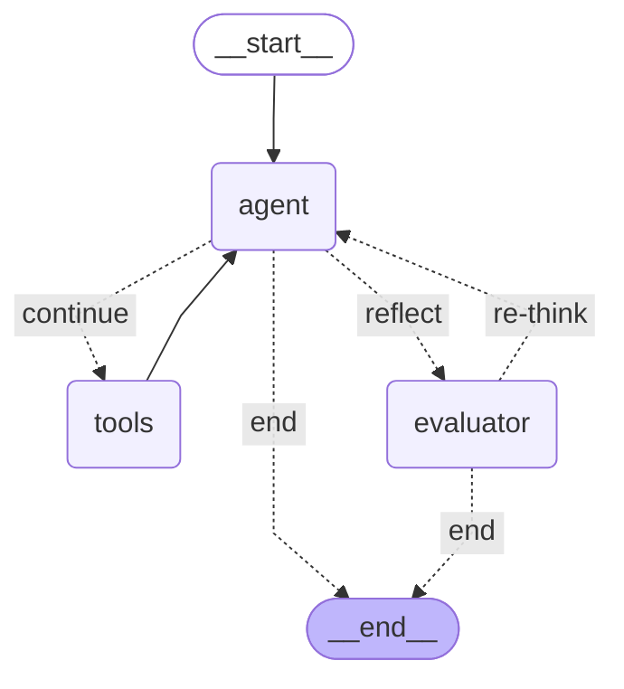
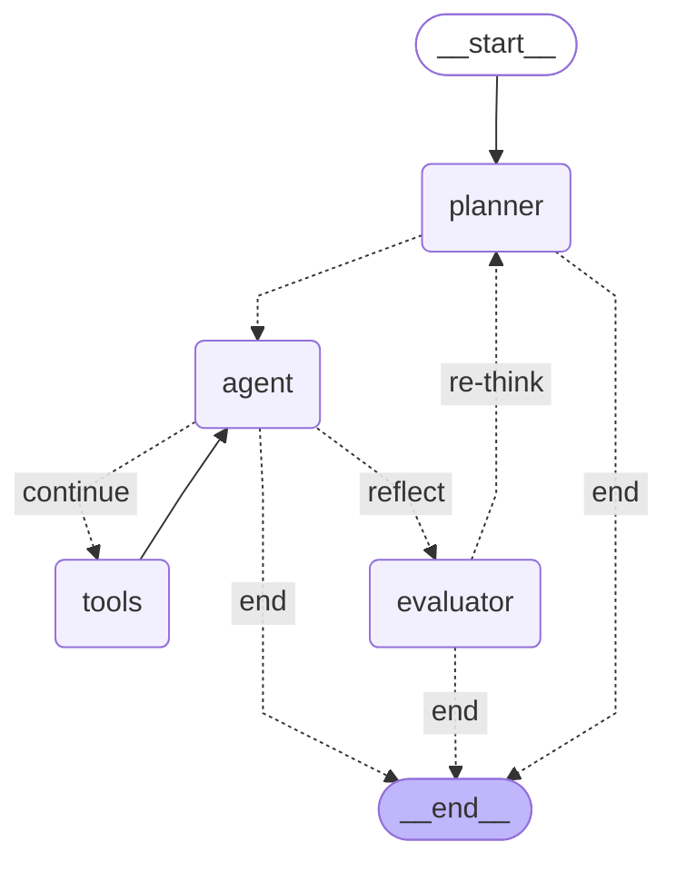

# Agentic RAG — PDF Knowledge QA System

> 基于 LangGraph 构建的多节点 Agent 系统，实现对本地 PDF 文档的智能问答。
> 项目经历了从手动实现 RAG Pipeline 到 LlamaIndex 框架重构的完整演进过程，重点在于将 RAG 作为**系统设计问题**而非 API 调用来对待。

---

## 系统架构

```
用户输入
   │
   ▼
┌─────────┐     action=tool      ┌─────────┐     tool_calls     ┌─────────┐
│ Planner │ ────────────────── │  Agent  │ ───────────────── │  Tools  │
│  意图判断 │     action=respond   │  执行层  │                    │ RAG检索  │
└─────────┘ ────────────────── └─────────┘ ─────────────────  └─────────┘
                                     │
                          submit_final_answer
                                     │
                                     ▼
                              ┌─────────────┐
                              │  Evaluator  │
                              │   质量评估   │
                              └─────────────┘
                                     │
                          conf < 0.6 or ans < 10
                                     │
                                     ▼
                              回退 Planner 重新规划（最多3轮）
```

**节点职责：**

- **Planner**：只看当前用户输入，判断是否需要调用工具，指定工具名。不生成答案，不接触历史消息，最小权限设计
- **Agent**：根据 Planner 决策执行，`action=tool` 时使用 `llm_with_tools`，`action=respond` 时使用 `llm_plain`，避免 Forced Tool Calling 报错
- **Tools**：执行 RAG 两阶段检索，校验工具调用是否符合 Planner 预期，拒绝越权调用并写回消息历史
- **Evaluator**：评估回答质量，不合格时回退 Planner 重新规划，而非直接重试 Agent

---

## RAG Pipeline

### 两阶段检索

```
Query
  │
  ▼
BGE-M3 向量检索（Bi-Encoder）
Top-15 候选结果
  │
  ▼
BGE-Reranker-v2-m3 精排（Cross-Encoder）
Top-5 最终结果
  │
  ▼
返回 Agent
```

**为什么是两阶段：**

- Bi-Encoder（BGE-M3）将 Query 和文档独立编码，检索时只做向量相似度计算，速度快，适合大规模召回
- Cross-Encoder（Reranker）将 Query 和文档拼接后做完整 Attention 计算，精度高但计算量大，只用于精排少量候选

直接用 Cross-Encoder 对全量文档做精排，计算量不可接受。两阶段是工业界标准做法。

### 语义分块

使用 LlamaIndex `SemanticSplitterNodeParser`，基于百分位数自适应切割：

- `breakpoint_percentile_threshold=95`：只切语义跳跃最突兀的 5% 位置
- 相比固定阈值，自适应策略在不同风格文档间无需重新调参
- 避免关键信息跨 chunk 断裂（Context Fragmentation）导致的检索失败

### 向量存储

Qdrant 内存模式，所有向量经 L2 归一化后存储。归一化后 Cosine 相似度退化为点积计算，降低检索开销。

> **当前限制**：内存模式不持久化，重启后需重新建索引。单文件单线程，不支持并发。

---

## 设计决策与演进

### 为什么引入 Planner

初版直接使用绑定工具的 LLM 作为 Agent。实际运行中发现：当用户提问不涉及 PDF 内容时，LLM 仍会尝试生成工具调用格式的输出，触发 provider 的 `BadRequestError`（Forced Tool Calling 问题）。

引入独立 Planner 节点，将意图判断与工具执行解耦：

- Planner 使用未绑定工具的 `llm_plain`，不存在 Forced Tool Calling 问题
- Planner 只看当前用户输入，避免历史消息中的工具调用模式干扰判断
- 工具名通过 `Literal` 类型硬约束，防止 Planner 指定不存在的工具

### 为什么反思回退到 Planner 而非 Agent

Evaluator 判定回答质量不合格时，根本原因可能是：

1. 检索策略错误（应该搜但没搜，或搜的关键词偏差）
2. 检索结果不完整（需要重新规划检索方向）

直接回退 Agent 只是重试，不改变检索策略。回退 Planner 让整个决策链重新运行，有机会修正更上游的错误。

### 从手动实现到 LlamaIndex 重构

初版手动实现完整 Pipeline：`SentenceTransformer.encode` → `QdrantClient.query_points` → `CrossEncoder.predict` → 排序过滤。

理解两阶段检索原理后，重构为 LlamaIndex 框架：

- `SemanticSplitterNodeParser` 替代 Chonkie，自适应分块
- `HuggingFaceEmbedding` + `SentenceTransformerRerank` 替代手动模型调用
- `VectorStoreIndex` 自动处理切片、向量化、上传

**重构不是为了省事，是在理解原理之后选择更合适的抽象层。**

---

## 已知局限与后续方向

**当前局限：**

- 反思机制依赖模型自评置信度，存在自我评估偏差（Self-evaluation Bias）
- Evaluator 无法区分失败类型：检索失败、推理失败、幻觉，统一触发重试
- 评估依赖人工判断，缺乏自动化评估 pipeline

**后续方向：**

- 引入独立 Evaluator LLM，基于检索内容而非模型自评判断质量（Faithfulness 检验）
- 接入 RAGAS 框架，量化评估 Faithfulness / Answer Relevance / Context Precision / Context Recall
- Multi-query：查询扩展与分解，提升召回覆盖率
- 支持多文档对比问答

---

## 技术栈

| 组件 | 技术选型 |
|------|--------|
| Agent 框架 | LangGraph |
| RAG 框架 | LlamaIndex |
| Embedding 模型 | BAAI/bge-m3 |
| Reranker 模型 | BAAI/bge-reranker-v2-m3 |
| 向量数据库 | Qdrant（内存模式） |
| LLM | Qwen-plus（OpenAI 兼容接口） |
| PDF 解析 | PyMuPDF |
| 终端渲染 | Rich |

---

## 快速开始

### 环境配置

```bash
git clone https://github.com/your-username/agentic-rag-pdf
cd agentic-rag-pdf
conda env create -f environment.yml
conda activate agent
```

### 配置 API Key

```bash
cp .env.example .env
# 编辑 .env，填入你的 API Key
```

## 放一个mermaid图看看
最开始的版本

加上planner以后

